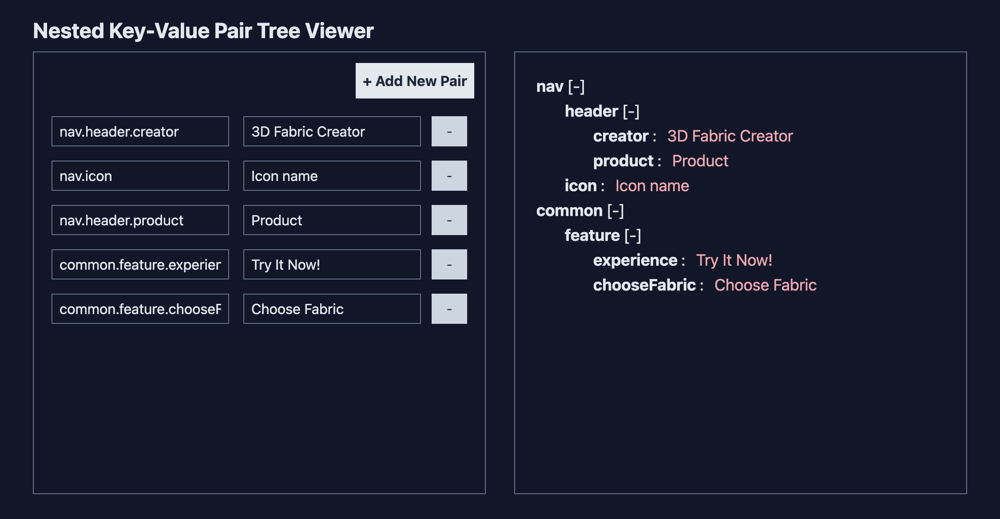

# Key-Pair Tree Viewer

## 📚 Overview

The Key-Value Tree Viewer is an interactive web application that dynamically adapts its structure based on user input. Explore a live demo of the application [here](https://key-pair-tree-viewer.netlify.app/).



## ✨ Features

- 📝 Create, update, and delete key value pairs.
- 🔄 Dynamic tree view and collapsible tree nodes.
- 🍍 State management using [**Pinia**](https://pinia.vuejs.org/).
- 📱 Sleek responsive design with [**Tailwind CSS**](https://tailwindcss.com/).
- 🐶 Simplify HTML syntax with **Pug**.
- 🧩 Utilizes Vue.js Composition API for better code organization.

## 🛠️ Project Setup

1. Clone the repository: `git clone https://github.com/maychang7331/key-pair-treeViewer.git`
2. Install dependencies: `npm install`
3. Compile and run the application: `npm run dev`
4. For production build: `npm run build`
5. Preview the build locally: `npm run preview`

## 🚀 Deploy with [Netlify](https://www.netlify.com/):

Get started with the Key-Pair Tree Viewer in a few simple steps:

1. Add new site, select Deploy manually
2. Create a file named `netlify.toml` in both "dist" and "root" folders with following content:
   ```
   [[redirects]]
   from = "/*"
   to = "/index.html"
   status = 200
   ```
3. Drag and drop the "dist" folder for deployment

## 🛠️ Create Environment From Scratch

If you want to set up your environment from scratch, follow these steps:

1. [Install Tailwind CSS with Vite using Vue](https://tailwindcss.com/docs/guides/vite#vue)
2. Install Pug: `npm install pug --save-dev`
3. Install [prettier-plugin-tailwindcss](https://github.com/tailwindlabs/prettier-plugin-tailwindcss) and rename the file extension to `prettier.config.cjs`.
4. Install [@vue/language-plugin-pug](https://www.npmjs.com/package/@vue/language-plugin-pug): `npm install -D @vue/language-plugin-pug` and configure "jsconfig.json" (for resolving issues in VSCode).
5. Install Pinia: `npm install pinia`

## 💡 Project Planning

Here's how I approached the project:

```
Todo List + Tree View
```

#### 🗓️ Todo List

1. Create input fields for both key and value, enabling saving key-value pairs using Pinia store.
2. Utilized Date.now() to assign unique IDs to each key-value pair, allowing independent addition or deletion using the + and - buttons.
3. Automatically preserving input field data as reactive dependencies changed.

#### 🌳 Tree View

1. Developed a tree structure based on the key-value pairs.
2. Dynamically adapting a tree structure based on changes in any key-value pair stored in Pinia.

## 🔗 Reference:

For more insights and resources, consider exploring these references:

- [Vue3 Tailwind CRUD example using Composition API and Pinia](https://github.com/kirangurung2023/vue3-talwind-todo)
- [Vue Todo List](https://github.com/aaronklinker-st/vue-todo)
- [JS: Convert dot string array to object tree](https://stackoverflow.com/questions/59836042/js-convert-dot-string-array-to-object-tree)
- [Vue Recursive Components](https://vuejs.org/api/sfc-script-setup.html#recursive-components)

Feel free to dive into the code and explore the possibilities this application offers! 😊
